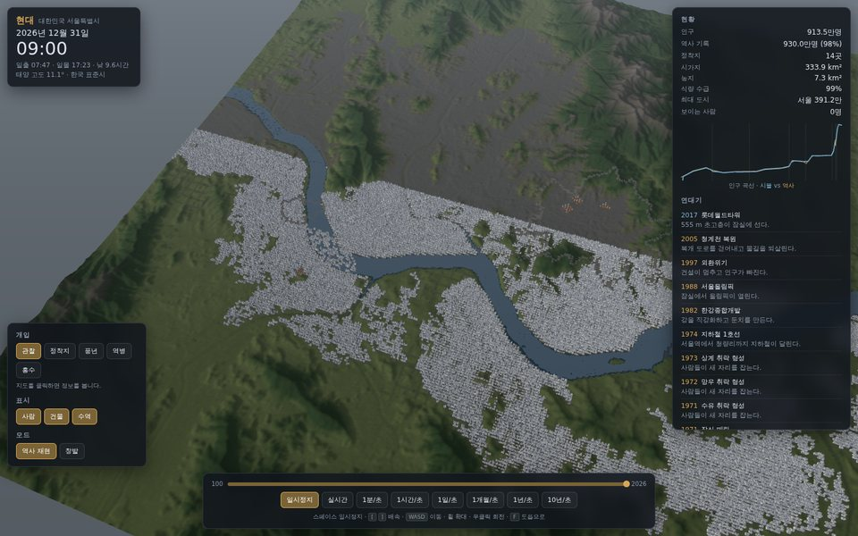

# CivSim — 서울 문명 시뮬레이터

서울 크기의 3차원 세계에서 서기 100년부터 2026년까지 문명이 쌓이는 과정을 관찰하는 시뮬레이터.

계획서: [`../docs/seoul-civilization-simulator-plan.md`](../docs/seoul-civilization-simulator-plan.md)

## 두 갈래

| | [`web/`](web/) — **지금 돌아감** | [`src/`](src/CivSim.Core) + `unity/` — Unity 경로 |
|---|---|---|
| 상태 | 완성. 68개 단위 테스트 + 39개 브라우저 검증 통과 | 시계·천문 코어와 M1 스크립트 초안 |
| 실행 | `web\Run-Windows.cmd` → 브라우저 | Unity 6 프로젝트 생성 필요 |
| 언어 | TypeScript + three.js | C# + Unity |
| 쓰임 | 바로 보고 조작하는 완성본 | 더 높은 그래픽 품질로 갈 때의 기반 |

두 갈래는 같은 모델을 쓴다. 천문·시간 코어는 검증된 파이썬 참조 구현(`tools/astro_reference.py`)을
양쪽으로 옮긴 것이고, 지형 데이터는 같은 베이크 툴에서 나온다.

## 바로 해보기

```powershell
cd civsim\web
.\Run-Windows.cmd
```

자세한 조작법과 검증 내용은 [`web/README.md`](web/README.md).



## 폴더

```
civsim/
├─ web/                    TypeScript + three.js 완성본 (여기서 시작)
│  ├─ src/core/            엔진 독립 시뮬레이션 코어
│  ├─ src/render/          three.js 렌더링
│  ├─ src/ui/              인터페이스
│  ├─ public/data/         베이크된 지형·수역 (1.6 MB)
│  ├─ tests/               단위 테스트 68개
│  ├─ scripts/             브라우저 검증
│  └─ docs/screens/        검증 스크린샷
├─ src/CivSim.Core/        C# 코어 (netstandard2.1, Unity에 링크)
├─ tests/CivSim.Core.Tests xUnit
├─ unity/Assets/CivSim/    Unity 6 스크립트
├─ tools/                  astro_reference.py, bake_dem.py, bake_world.py, Setup-Windows.ps1
└─ data/                   원본 DEM 타일 (git에 포함되지 않음)
```

## Unity 경로 (선택)

C# 코어를 빌드하고 테스트하려면 .NET 8 SDK가 필요하다.

```powershell
cd civsim
.\tools\Setup-Windows.ps1        # 도구 확인 → dotnet test → 지형 베이크
.\tools\Setup-Windows.ps1 -LinkUnity -SkipTests   # Unity 프로젝트를 만든 뒤
```

Unity Hub에서 Unity 6, URP 3D 템플릿으로 `civsim\unity`에 프로젝트를 만든 다음 씬을 구성한다:
`SimClockBehaviour`, `SunLightController`, `GodViewCamera`, `TerrainLoader`, `TimeControlPanel`.

참고: 이 저장소의 C# 코드는 검증된 파이썬 참조를 옮긴 것이며, 작성 환경에 .NET SDK가 없어
`dotnet test`는 아직 실행되지 않았다. 같은 로직의 TypeScript 판은 전부 통과한다.

## 지형 데이터

```powershell
pip install numpy rasterio pillow
python tools\bake_dem.py --download data\raw
python tools\bake_world.py --raw data\raw --out web\public\data
```

Copernicus DEM GLO-30, © DLR e.V. 2010-2014 및 © Airbus Defence and Space GmbH 2014-2018,
유럽연합과 ESA가 COPERNICUS로 제공.
