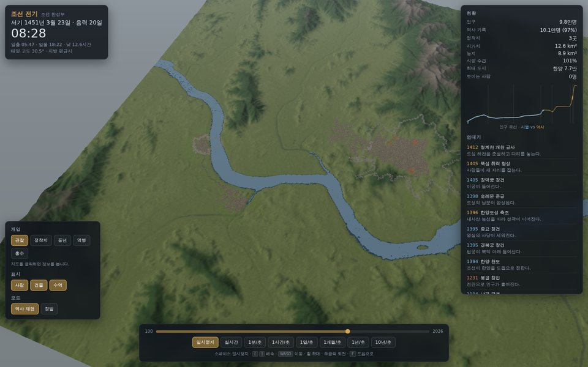

# 서울 문명 시뮬레이터 (웹 빌드)

서울 크기의 3차원 세계에서 **서기 100년부터 2026년까지** 사람들이 문명을 쌓아 올리는 과정을
절대 시점에서 관찰하는 시뮬레이터. 브라우저에서 바로 돌아간다.



## 바로 실행 (윈도우)

파일 탐색기에서 `civsim\web\Run-Windows.cmd` 를 더블클릭한다. 또는 터미널에서:

```powershell
cd civsim\web
.\Run-Windows.cmd
```

`.cmd` 로 실행하면 PowerShell 실행 정책을 건드릴 필요가 없다.
Node.js 20 이상이 필요하고, 없으면 스크립트가 winget 설치를 제안한다.
브라우저가 자동으로 `http://127.0.0.1:5173/` 를 연다.

옵션:

```powershell
.\Run-Windows.cmd -Build    # 정적 빌드 후 미리보기 서버
.\Run-Windows.cmd -Test     # 단위 테스트 68개만 실행
```

### 스크립트 없이

명령 프롬프트(cmd.exe)에서는 그냥 된다.

```
cd civsim\web
npm install
npm run dev
```

PowerShell에서는 `npm` 이 `npm.ps1` 로 해석되어 실행 정책에 막힐 수 있다. 그럴 때는 확장자를 붙인다.

```powershell
npm.cmd install
npm.cmd run dev
```

## 잘 안 될 때

| 증상 | 원인과 해결 |
|---|---|
| `.ps1` 실행 거부, `npm.ps1을 로드할 수 없습니다` | PowerShell 실행 정책 때문이다. `Run-Windows.cmd` 로 실행하거나, PowerShell에서는 `npm.cmd` 처럼 확장자를 붙여 부른다. 창마다 풀려면 `Set-ExecutionPolicy -Scope Process -ExecutionPolicy Bypass`, 계정에 한 번만 걸어두려면 `Set-ExecutionPolicy -Scope CurrentUser -ExecutionPolicy RemoteSigned` 이다. 후자는 관리자 권한이 필요 없다. |
| 콘솔의 한글이 깨짐 | 스크립트는 BOM이 붙은 UTF-8이라 정상이어야 한다. 그래도 깨지면 Windows Terminal에서 실행하거나 `npm run dev`를 직접 쓴다. |
| `npm`을 찾을 수 없음 | Node.js 설치 후 PowerShell 창을 새로 열어야 PATH가 잡힌다. |
| 화면이 검게만 나옴 | 브라우저의 하드웨어 가속이 꺼져 있다. 크롬 설정에서 켜고 새로고침한다. |
| 5173 포트가 사용 중 | Vite가 다른 포트로 띄우고 터미널에 주소를 출력한다. 그 주소를 쓴다. |
| 브라우저가 자동으로 안 열림 | 터미널에 찍힌 주소를 직접 입력한다. |

## 조작

| 조작 | 동작 |
|---|---|
| 배속 버튼 8개 | 일시정지 · 실시간 · 1분/초 · 1시간/초 · 1일/초 · 1개월/초 · 1년/초 · 10년/초 |
| 스페이스 | 일시정지 / 재개 |
| `[` `]` | 배속 한 단계 내리기 / 올리기 |
| `WASD` · 방향키 | 이동 |
| 마우스 휠 | 줌 (위성 고도 ↔ 골목) |
| 좌클릭 드래그 | 지도 끌기 |
| 우클릭 드래그 | 회전 |
| `Q` `E` | 좌우 회전 |
| `F` | 도읍으로 |
| 하단 타임라인 | 임의의 연도로 이동 (뒤로 가면 처음부터 다시 계산) |
| 지도 클릭 | 그 자리의 지형·인구·정착지·사람 정보 |

개입 도구: **정착지** 씨앗 놓기, **풍년**, **역병**, **홍수**.
표시 토글: 사람 / 건물 / 수역. 모드: **역사 재현** / **창발**.

## 무엇이 진짜인가

- **지형** — Copernicus DEM GLO-30 실측 고도. 최고점이 위도 37.6587에서 796 m로 북한산 백운대와 일치한다.
- **수역** — DEM에서 하류 경사를 따라 검출한 한강. 총 42 km²로 실제 서울 구간과 일치하고,
  강폭은 행주대교 1.5/1.4 km, 잠실대교 0.9/1.0 km, 강동대교 0.9/0.9 km (측정/실제).
- **좌표** — 서울시청(37.5665°N, 126.9780°E)을 원점으로 한 미터 좌표계. 클릭하면 실제 위경도가 나온다.
- **태양** — Meeus 『Astronomical Algorithms』 25장. 실제 일주·연주 운동, 균시차, ΔT(서기 100년에 약 2.7시간),
  황도 경사 변화(서기 100년 23.68° → 현재 23.44°)까지 반영. 서울 하지 남중고도 75.9°, 동지 29.0°.
- **달** — 47장 주요 항. 위상과 고도가 맞고, 1896년 이전에는 음력 날짜를 함께 표시한다.
- **시간대** — 1908년 이전 지방 평균시(UTC+8:27:54) → 대한제국 표준시 → 일본 표준시 → UTC+8:30 → 현재 KST.
- **인구** — 호구 기록과 국세조사에 기반한 37개 기준점을 통과한다 (§인구 참조).
- **역사 사건** — 45개 앵커: 풍납토성 축조, 475년 고구려의 한성 함락, 1394년 한양 천도, 임진왜란,
  한국전쟁, 1963년 행정구역 확장, 여의도·잠실 매립, 1988년 올림픽 등.

## 시뮬레이션 구조

```
src/core/                엔진 독립 시뮬레이션 (DOM·three.js 의존 없음)
├─ time/                 율리우스일, 한국 시간대 이력, 배속 8단계, SimClock
├─ astro/                ΔT, 태양 위치, 일출·일몰, 달
├─ geo/                  시청 원점 로컬 좌표계
├─ world/                지형 로딩, 파생 격자(경사·비옥도·건축적성·수계거리), 역사 데이터
├─ era/                  9개 시대와 건물 키트
├─ pop/                  5세 단위 코호트 인구학
├─ econ/                 식량·자재·재정 stock-and-flow, 시대별 교역 비중
├─ settle/               정착지 확장·축소, 성곽, 매립, 도로 A*
├─ polity/               세력 연표
├─ agents/               카메라 근처에서만 소환되는 개인
└─ sim.ts                오케스트레이터

src/render/              three.js: 지형, 수역, 하늘, 도시, 군중, 카메라
src/ui/                  시간 막대, 현황판, 연대기, 개입 도구
```

### 3층 LOD

| 층 | 다루는 것 | 도는 배속 |
|---|---|---|
| 매크로 | 코호트 인구, 경제, 세력, 앵커 사건 | 1시간/초 이상 |
| 메조 | 정착지 면적, 토지 이용, 건물 밀도, 도로, 성곽 | 1일/초 이상 |
| 마이크로 | 카메라 반경 안 개인 (최대 5,200명) | 1분/초 이하 + 일시정지 |

배속이 올라가면 개인은 통계로 흡수되고, 내려오면 정착지 통계와 시각별 일과에서 다시 소환된다.
매크로 스텝은 배속에 따라 일 → 월 → 년으로 적응한다.

### 인구를 역사에 맞추는 방식

"역사 재현" 모드에서 총인구는 기록 곡선을 따라가되, **그 힘은 이주로 들어온다.**
실제로 서울을 200만에서 1,000만으로 만든 것이 이촌향도였기 때문이다.
어느 칸에 살게 되는지는 각본이 아니라 지형이 정한다. 평탄하고, 마르고, 물에 가깝고,
이미 지어진 곳에 가까운 칸이 선택된다. 그래서

- 한성백제는 풍납토성이 있는 **강남**에서 자라고,
- 1394년 천도 뒤 도시는 **강북**으로 옮겨 5세기 반 동안 강을 건너지 않으며,
- 1963년 행정구역 확장과 1968·1971년 매립 뒤에야 **다시 강남**으로 퍼진다.

"창발" 모드는 이 보정을 끄고 인구 동역학만으로 돌린다.

## 검증

```bash
npm test          # 68개 단위 테스트
npm run build && npm run verify   # 39개 브라우저 검증 + 스크린샷
```

### 단위 테스트 (68개)

- **천문 35개** — 율리우스일 왕복, 그레고리력 개혁 경계, 한국 시간대 이력,
  서울 4절기 일출·일몰(한국천문연구원 표와 2분 이내), 남중고도(0.3° 이내), 춘분 정동·정서 일출몰,
  균시차 극값, 지구 자전(방위각 단조 증가), ΔT 범위, 달 삭망과 적위 범위.
- **월드 13개** — 좌표계 왕복, 실제 고도(북한산 >700 m, 남산 200~300 m, 관악산 >500 m),
  최고점 위치, 한강의 전 구간 관통과 면적, 파생 격자의 정합성.
- **시뮬 20개** — 인구 기준점 통과, 서기 100~2026년 완주 후 14개 시점에서 역사 대비 ±25% 이내,
  시대·세력 전환 순서, 강 남북 전개(백제 남 → 조선 북 → 현대 양안), 천도, 성곽의 능선 추종,
  조선 한양 인구밀도, 여의도·잠실 매립, 앵커 순서, 결정성.

### 브라우저 검증 (39개)

실제 Chromium에서 빌드된 앱을 띄워 확인한다. 태양 위치를 화면에서 읽어 천문 계산과 0.05° 이내로 대조하고,
각 시대로 빨리 감아 인구·건물·시가지를 확인하고, 줌인했을 때 사람이 실제로 소환되는지 본다.
결과는 `docs/verification-report.txt`, 스크린샷은 `docs/screens/`.

마지막 실행: **39개 전부 통과**, 인구는 서기 400년 96%, 1450년 97%, 1900년 98%, 1975년 97%, 2026년 99%.

## 인구 기준점 일부

| 연도 | 기록 | 비고 |
|---|---|---|
| 100 | 12,000 | 한강변 촌락 |
| 400 | 42,000 | 한성백제 전성 |
| 475 | 30,000 | 고구려의 한성 함락 |
| 1428 | 103,000 | 세종조 한성부 호구 |
| 1600 | 70,000 | 임진왜란 직후 |
| 1669 | 194,000 | 현종조 호구 |
| 1942 | 1,114,000 | 전시 경성 |
| 1951 | 650,000 | 한국전쟁 피난 |
| 1970 | 5,433,000 | 고도성장 |
| 1990 | 10,613,000 | 정점 |
| 2026 | 9,300,000 | 현재 |

전체는 `src/core/world/history.ts`.

## 지형 데이터 다시 만들기

저장소에는 이미 베이크된 1.6 MB 데이터가 들어 있다. 직접 만들려면:

```powershell
pip install numpy rasterio pillow
cd civsim
python tools\bake_dem.py --download data\raw          # Copernicus 타일 2장 (78 MB)
python tools\bake_world.py --raw data\raw --out web\public\data
```

출처: Copernicus DEM GLO-30, © DLR e.V. 2010-2014 및 © Airbus Defence and Space GmbH 2014-2018,
유럽연합과 ESA가 COPERNICUS로 제공.

## 성능

시뮬레이션 코어는 서기 100년부터 2026년까지 전 구간을 Node에서 약 5초에 돈다.
화면은 지형 100만 삼각형에 건물 인스턴스가 최대 9만 개이며, 실제 GPU에서는 여유가 있다.
배속은 프레임 속도에 묶여 있으므로, 아주 느린 기기에서는 10년/초가 그만큼 느려진다.

## 알려진 한계

- 되감기가 없다. 타임라인을 뒤로 끌면 처음부터 다시 계산한다(전 구간 약 5초).
- 전쟁은 결정대로 통계로만 표현한다. 병력은 그려지지 않고 인구와 건물만 변한다.
- 건물은 시대별 키트로 절차 생성한 것이고, 경복궁·숭례문 같은 개별 건축의 실제 형태는 아니다.
- 지형은 50 m 격자라 골목 높이에서 보면 완만하다.
